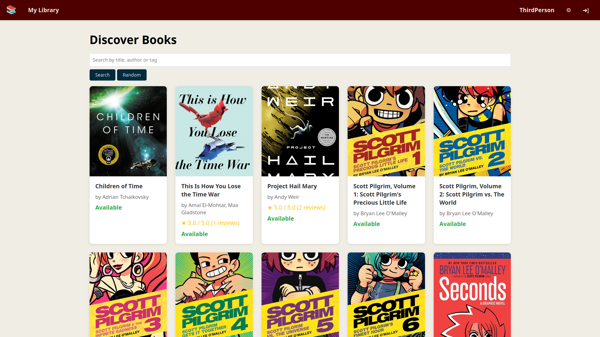

# Nook: A Digital Library for Friends


Nook is a self-hosted website where you can share your book collection with friends! Look at what other people recommend and see what books you can borrow from them.

To set up your instance of Nook, use Conda or Miniconda and create a Conda environment using:
```bash
conda create --file environment.yaml
```
Then, activate the environment using `conda activate nook`. 

Alternatively, you can use pip `pip install -r requirements.txt` with `Python 3.13.14`, for more
limited reproducibility.

Once your environment is set up, run the following commands in the repository directory:
```bash
python manage.py migrate
```

This will set up your instance of the project. Afterward, run the following command to start the server:
```bash
python manage.py runserver 0.0.0.0:8080
```
